# Phase 3 Modbus Attack Traffic Analysis - Unauthorized Coil Manipulation

This document contains forensic evidence from the malicious Modbus/TCP attack against the PLC, demonstrating unauthorized coil manipulation with clear deviations from baseline behavior.

**PCAP File:** `phase3_modbus_attack.pcapng`
**Source:** 192.168.20.10 (hmi-ubuntu - compromised HMI)
**Destination:** 192.168.20.20:502 (plc-server - PLC)
**Attack Script:** `coil_manipulation_attack.py`

---

## 1. Full Capture Overview - Modbus Traffic (Port 502)

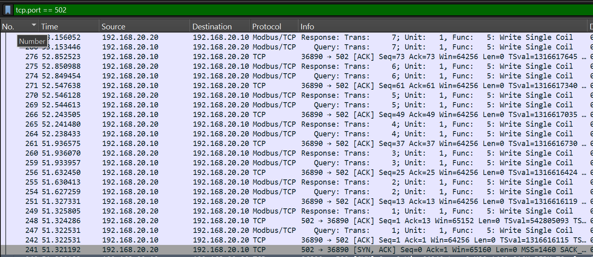

**Description:** Complete packet list showing all Modbus/TCP traffic on port 502 during the attack. Compare packet density and volume to baseline.

**Attack Indicators:**
- **Significantly higher packet density** vs. baseline
- Burst pattern of rapid consecutive write operations
- Dramatically different traffic volume
- Compressed timeframe (attack completes in seconds vs. minutes for baseline)

---

## 2. Protocol Hierarchy Statistics

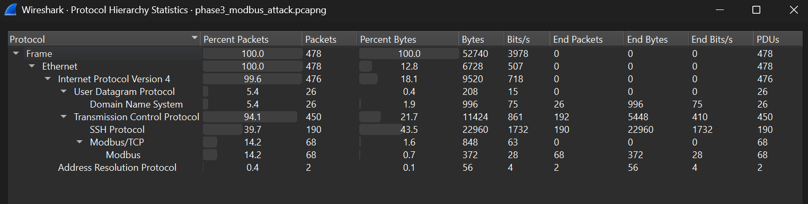

---

## 3. Read Coils Operations (Function Code 1) - Minimal Activity

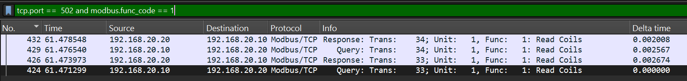

**Description:** Dramatically reduced read operations compared to baseline monitoring traffic.

**Attack Indicators:**
- **Minimal read operations** vs. continuous polling in baseline
- No read-before-write verification pattern
- Attacker executing blind writes without state checking
- Absence of monitoring behavior typical of legitimate HMI

---

## 4. Read Input Registers (Function Code 4) - Absence of Monitoring

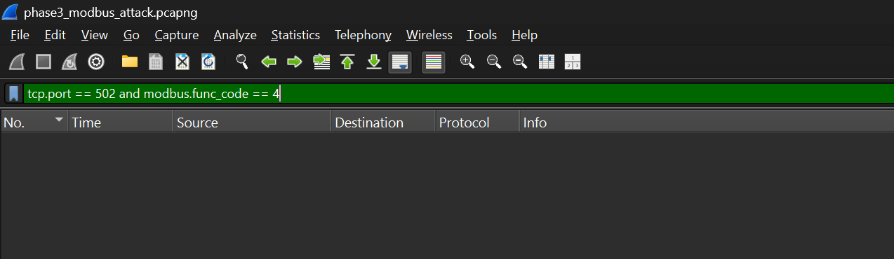

**Description:** Complete absence of Read Input Registers operations during attack window.

**Attack Indicators:**
- **NO monitoring of voltage/current/analog values**
- Legitimate operators continuously monitor electrical parameters
- Attacker focused solely on coil manipulation, not process monitoring
- Clear deviation from baseline HMI behavior

---

## 5. Write Single Coil Operations (Function Code 5) - Excessive Activity

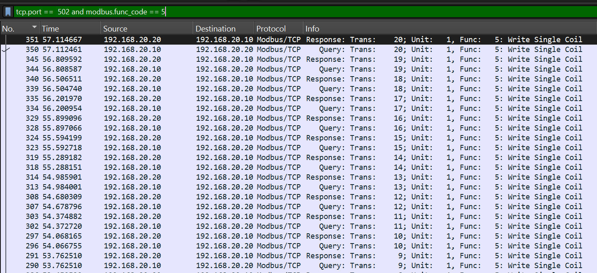

**Description:** Packet details showing extensive use of Function Code 5 (Write Single Coil), particularly for emergency breaker toggling.

**Attack Indicators:**
- **Numerous FC5 operations** vs. only 2 in baseline
- Rapid toggling of critical coil 50 (emergency main breaker)
- 10 iterations of TRUE/FALSE cycling in rapid succession
- Targets safety-critical addresses not touched in baseline

---

## 6. Write Multiple Coils Operations (Function Code 15) - CRITICAL ATTACK SIGNATURE

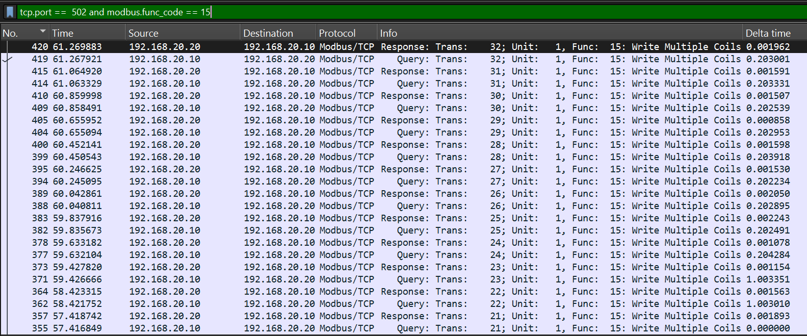

**Description:** Packet details showing Function Code 15 (Write Multiple Coils) - NOT present in baseline traffic.

**CRITICAL ATTACK INDICATORS:**
- **FC15 count: >0 (was 0 in baseline)**
- Mass write operations to 10+ coils simultaneously
- Used for capacitor bank disruption (coils 10-14)
- Used for disconnect switch cycling (coils 20-29)
- Capability never used in legitimate operations

---

## 7. Mass Feeder Write - All 10 Feeders Simultaneously

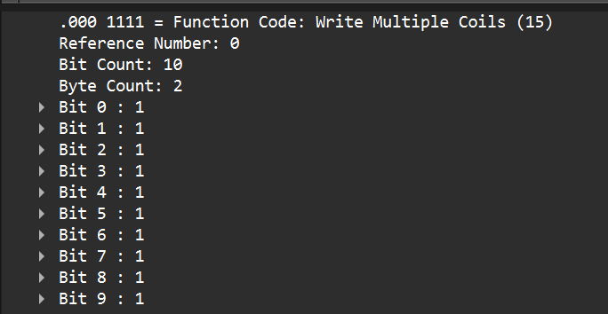

**Description:** Function Code 15 operation writing to coil addresses 0-9, forcing all 10 distribution feeders CLOSED simultaneously.

**ATTACK SIGNATURE - Phase 2:**
- Simultaneous energization of all feeders
- Creates massive overload condition on distribution transformer
- **REAL-WORLD IMPACT:** Transformer thermal overload, potential equipment failure, regional blackout risk
- Never occurs in normal operations (feeders energized selectively based on load)

---

## 8. Timing Analysis - Rapid Attack Intervals

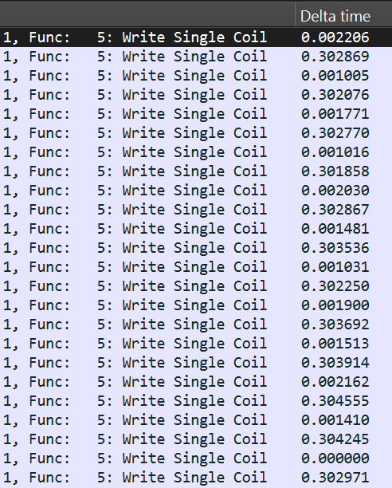

**Description:** Packet list with "Delta time displayed" column showing time intervals between consecutive Modbus write operations during attack.

**CRITICAL ATTACK METRIC:**
- **0.2-0.3 second delays between write operations**
- **13-20x faster than 4-second baseline**
- Scripted automation, not human operator
- Physically impossible for human to execute this timing
- Definitive indicator of automated attack script

---

## 9. Rapid Writes Visualization

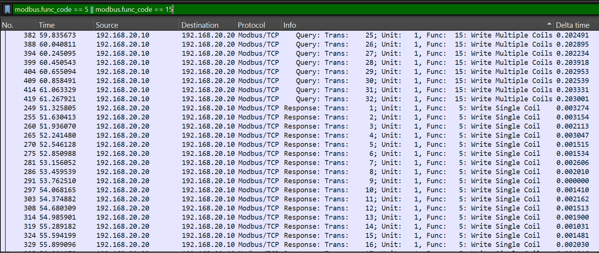

**Description:** Packet sequence showing burst of rapid write operations in quick succession.

**Attack Indicators:**
- Consecutive writes with no intervening reads
- No verification or state checking between operations
- Burst pattern inconsistent with human operator behavior
- Attack phases execute in rapid sequence

---

## 10. Absence of Read-Before-Write Pattern

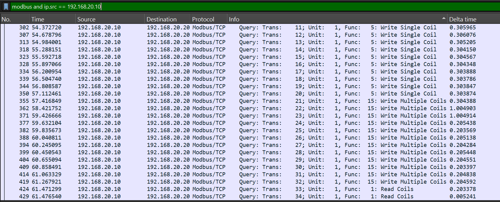

**Description:** Traffic pattern showing write operations executed without the read-verify-write sequence observed in baseline.

**CRITICAL ATTACK INDICATOR:**
- **NO read-before-write pattern** (baseline always read first)
- Blind command injection without state verification
- Attacker not following safe operational procedures
- No post-write verification reads
- Indicates unauthorized, reckless control actions

---

## 11. I/O Graph - Attack Burst Pattern

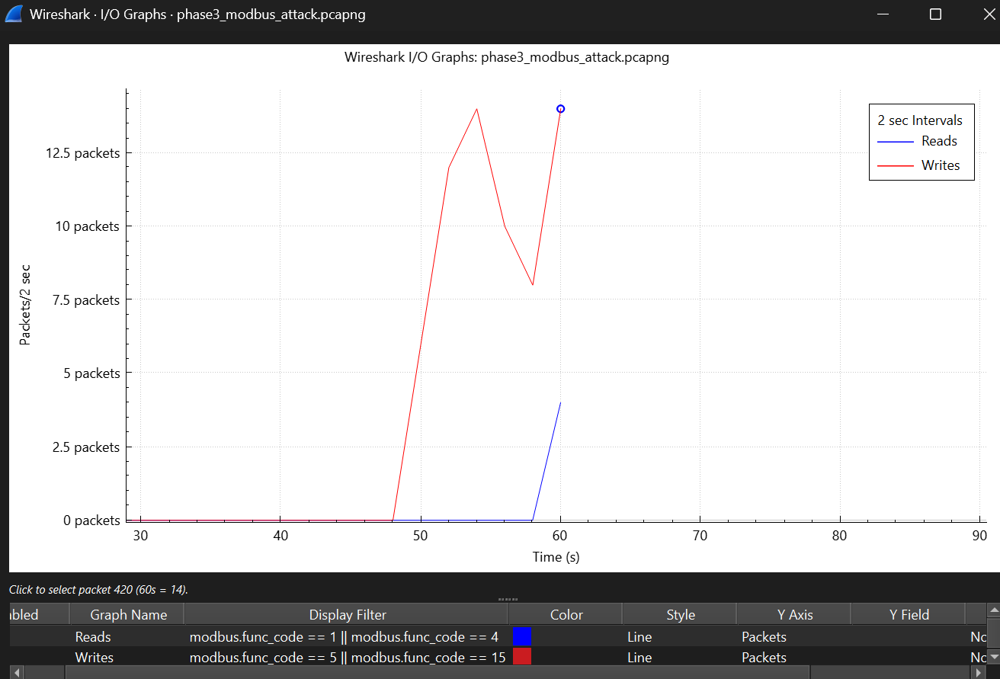

**Description:** Time-series visualization of Modbus traffic during attack, showing dramatic burst pattern vs. baseline steady polling.

**CRITICAL ATTACK INDICATORS:**
- **Dramatic spikes in write operations** vs. baseline steady pattern
- Minimal read activity (blue line nearly absent, only to check state at end)
- Write traffic (red line) dominates completely
- Visual representation of attack signature

---

## 12. Conversation Statistics - Attack vs Baseline

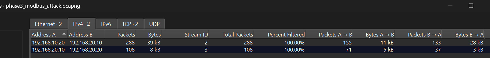

**Description:** Summary statistics for the TCP session during attack, showing significantly different metrics from baseline.

**HMI -> PLC:**
- Total packets:  288 (vs. 25 baseline)

---

## Attack Pattern Summary - Four-Phase Signature

**Phase 1: Emergency Breaker Toggling**
- Coil 50 (emergency main breaker) toggled 10 times
- 0.3-second intervals
- Function Code 5 (Write Single Coil)
- Creates electrical transients and equipment stress

**Phase 2: Mass Feeder Energization**
- Coils 0-9 (all feeders) forced CLOSED simultaneously
- Single Function Code 15 operation
- Creates dangerous transformer overload condition

**Phase 3: Capacitor Bank Disruption**
- Coils 10-14 (capacitor banks) forced OFFLINE
- Function Code 15 operation
- Degrades power quality and voltage stability

**Phase 4: Disconnect Switch Rapid Cycling**
- Coils 20-29 (disconnect switches) cycled 5 times
- 0.2-second intervals (fastest attack phase)
- Function Code 15 operations
- Extreme arc flash and equipment destruction risk

---

## Forensic Evidence - Attack Indicators vs Baseline

| Indicator | Baseline | Attack | Analysis |
|-----------|----------|--------|----------|
| **Write Timing** | 4-second delays | 0.2-0.3 second delays | **13-20x faster** - scripted automation |
| **Operation Pattern** | Read-before-write | Write-only (blind injection) | No verification - reckless |
| **Function Codes** | FC5 (2 operations) | FC5 (many) + FC15 (20+ operations) | Mass writes capability used |
| **Coil Addresses** | 0-4 (operational range) | 0-29, 50 (safety systems) | Expanded to critical systems |
| **Traffic Pattern** | Steady polling | Burst of rapid writes | Fundamentally different behavior |
| **Read Operations** | Continuous monitoring | Minimal/none | No process awareness |
| **FC15 Usage** | 0 instances | Multiple instances | NEW capability - attack signature |

---

## Conclusion - Definitive Attack Signature

This traffic analysis provides irrefutable forensic evidence of unauthorized Modbus coil manipulation:

1. **Timing Anomaly:** 13-20x faster than human-paced baseline (automated script)
2. **Function Code Shift:** Write-heavy vs. read-heavy baseline (attack vs. monitoring)
3. **FC15 Usage:** Present in attack, absent in baseline (mass write capability)
4. **No Verification:** Blind writes without read-before-write pattern (reckless behavior)
5. **Safety System Access:** Coils 50, 20-29 accessed (never touched in baseline)
6. **Four-Phase Signature:** Matches documented ICS substation disruption attack pattern

**Assessment:** High-confidence malicious activity. Traffic patterns incompatible with legitimate HMI operations.

---

**Analysis Date:** 2025-12-05
**Analyst:** Trevor Ritchie
**Purpose:** Document forensic evidence of unauthorized Modbus coil manipulation attack for incident response and technical reporting
