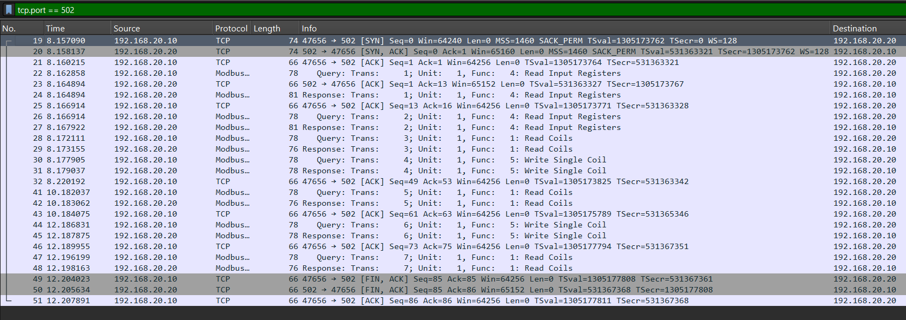
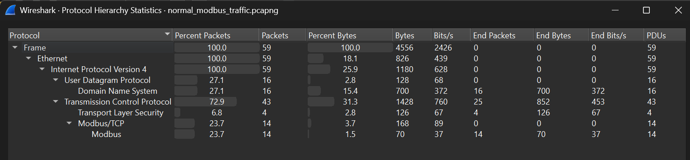
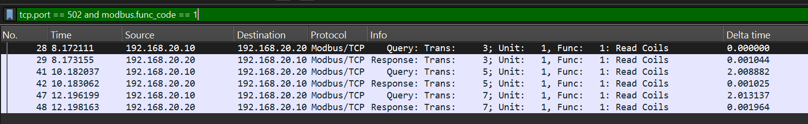
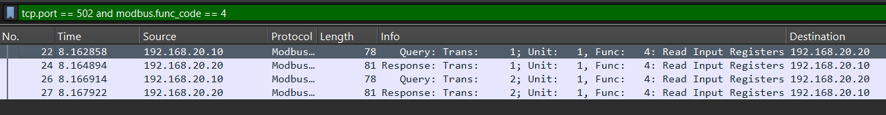
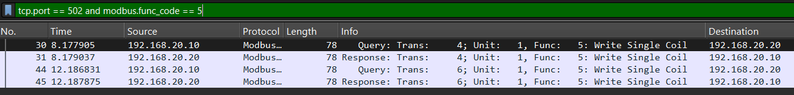
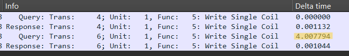
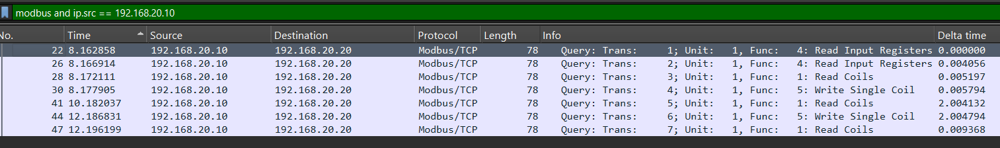
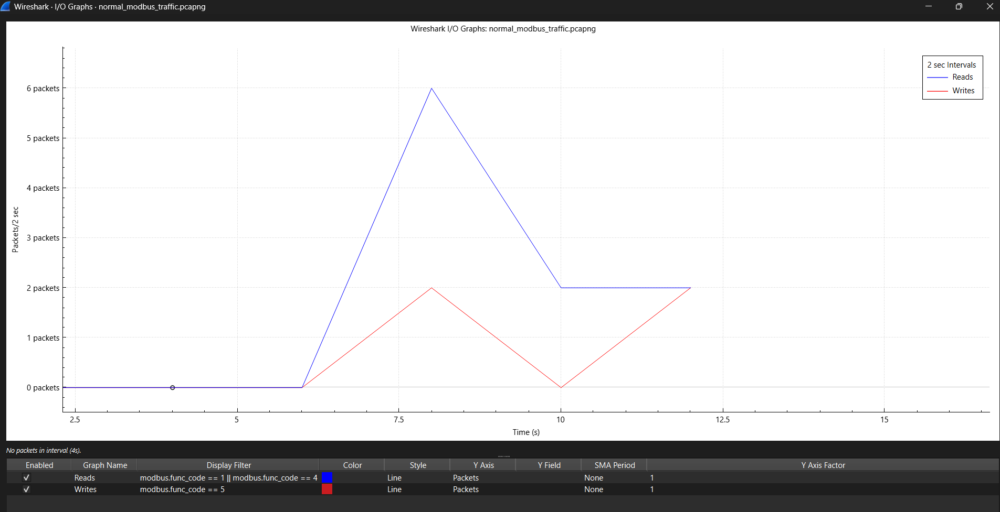
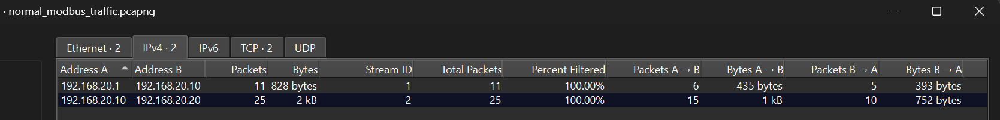

# Baseline Modbus Traffic Analysis - Normal Operations

This document contains forensic evidence from normal HMI-to-PLC Modbus/TCP communications, establishing the behavioral baseline for comparison against attack traffic.

**PCAP File:** `normal_modbus_traffic.pcapng`
**Source:** 192.168.20.10 (hmi-ubuntu - HMI)
**Destination:** 192.168.20.20:502 (plc-server - PLC)
**Script:** `legitimate_hmi_operations.py`

---

## 1. Full Capture Overview - Modbus Traffic (Port 502)

**Description:** Complete packet list showing all Modbus/TCP traffic on port 502. Displays total packet count, duration, and overall traffic pattern for baseline operations.

**Key Observations:**
- Steady, predictable traffic pattern
- Regular read operations interspersed with occasional writes
- Human-paced operational tempo

---

## 2. Protocol Hierarchy Statistics

---

## 3. Read Coils Operations (Function Code 1)

**Description:** Packet details showing Function Code 1 (Read Coils) operations used to query PLC coil states.

**Key Observations:**
- Regular polling of coil status
- Read operations for monitoring breaker states
- Part of normal HMI monitoring workflow

---

## 4. Read Input Registers Operations (Function Code 4)

**Description:** Packet details showing Function Code 4 (Read Input Registers) operations used to query voltage, current, and other analog values.

**Key Observations:**
- Monitoring of electrical parameters
- Typical HMI data acquisition pattern
- No manipulation, read-only monitoring

---

## 5. Write Single Coil Operations (Function Code 5)

**Description:** Packet details showing Function Code 5 (Write Single Coil) operations - the only write operations in baseline traffic.

**Key Observations:**
- Limited write operations (only 2 total)
- Targets operational coil addresses (Feeder 2 - coil 1)
- Deliberate, operator-paced actions
- Each write preceded and followed by read operations (verification pattern)

---

## 6. Timing Analysis - Inter-Write Intervals

**Description:** Packet list with "Delta time displayed" column showing time intervals between consecutive Modbus write operations.

**CRITICAL BASELINE METRIC:**
- **4-second delays between write operations**
- Human-paced, deliberate operator actions
- Includes time for verification reads and decision-making
- Establishes timing baseline for attack comparison

---

## 7. Read-Before-Write Operational Sequence

**Description:** Traffic pattern showing legitimate operational procedure: read current state, perform write operation, verify result with another read.

**Key Observations:**
- Read-before-write pattern (safe operational practice)
- Post-write verification reads
- Confirms operator is checking state before and after changes
- Indicates careful, deliberate control actions

---

## 8. I/O Graph - Traffic Pattern Visualization

**Description:** Time-series visualization of Modbus traffic patterns, with reads and writes displayed as separate series.

**Key Observations:**
- Steady baseline of read operations (monitoring)
- Minimal, evenly-spaced write operations
- Predictable, regular polling intervals
- No burst patterns or rapid changes

---

## 9. Conversation Statistics

**Description:** Summary statistics for the TCP session between HMI and PLC, including total packets, bytes transferred, and session duration.

**HMI -> PLC:**
- Total packets: 25 _____
- Total bytes:  752

---

## Baseline Summary - Key Characteristics

**Traffic Profile:**
- **Function Codes:** Predominantly FC1 (Read Coils) and FC4 (Read Input Registers)
- **Write Operations:** 2 total (FC5 - Write Single Coil)
- **Write Timing:** 4-second intervals (human-paced)
- **Operation Pattern:** Read-before-write with verification
- **Coil Addresses:** 0-4 (operational range only, no safety systems)
- **Traffic Pattern:** Steady, predictable polling

**Behavioral Indicators of Legitimate Operations:**
- Deliberate, operator-paced timing
- Verification reads before and after writes
- Limited scope (only operational feeders)
- No mass write operations (FC15 not used)
- Consistent with normal HMI monitoring and control

---

**Analysis Date:** 2025-12-05
**Analyst:** Trevor Ritchie
**Purpose:** Establish baseline for forensic comparison against unauthorized Modbus coil manipulation attack
